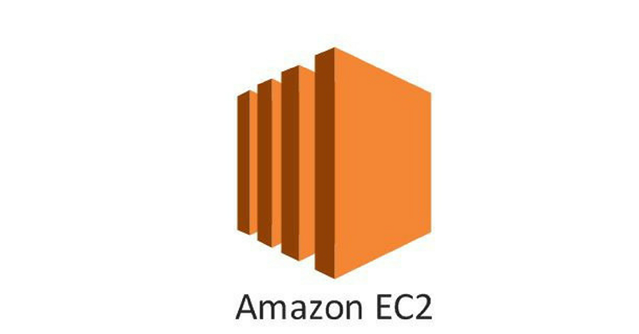

# VPC là gì?
VPC (Virtual Private Cloud) giúp bạn tạo ra một môi trường tách biệt, nơi mà bạn có thể triển khai hệ thống trong một hệ thống mạng ảo riêng mà bạn định nghĩa. Bạn có toàn quyền quyết định môi trường mạng ảo này sẽ như thế nào, bao gồm lựa chọn dải IP của riêng bạn, tạo mạng con (subnet), bảng định tuyến (route table) và cổng kết nối mạng (net gateway), cũng có thể sử dụng cả IPv4 và IPv6 cho bảo mật và dễ dàng truy cập ứng dụng, tài nguyên của bạn.

Bạn có thể dễ dàng điều chỉnh cấu hình VPC, tạo mạng con công khai cho các máy chủ thông qua Internet, đặt các hệ thống backend như cơ sở dữ liệu (database) hoặc máy chủ ứng dụng (application server) trong một mạng riêng tư không có kết nối Internet. Bạn có thể sử dụng nhiều lớp bảo mật, bao gồm nhóm bảo mật (security groups) và danh sách kiểm soát truy cập mạng (network access control lists), để có thể kiểm soát quyền truy cập vào các máy chủ (EC2 instances) trong từng mạng con (subnet).

# Các thành phần của VPC
Subnet
Subnet chia nhỏ một mạng to thành các mạng con. Kiểm soát các mạng con thì dễ dàng hơn so với một mạng to. Thông thường sẽ chia ra public subnet cho các dịch vụ truy cập Internet, còn private subnet dành cho các phần nội bộ, không cần truy cập Internet như database, ...

# Internet Gateway
Internet Gateway là một thành phần quan trọng cho phép các Instance có thể truy cập đến Internet. Nó cho phép người dùng kết nối mạng con đến Internet bằng việc cung cấp một route tới Internet. Với sự trợ giúp của Internet Gateway, một Instance có thể truy cập Internet và các resources bên ngoài cũng có thể kết nối với instance này.

# Security Group
Lớp bảo mật cho Instance, có thể coi như là firewall, cần phải định nghĩa các quy tắc trước khi traffic ra vào Instance.

# Route Table
Route table có thể hiểu là một bảng định tuyến, bao gồm các quy tắc định tuyến, hiểu đơn giản đây là một cái bảng chỉ dẫn đường đi, chỉ cần nhìn vào đây là biết được sẽ phải đi tới đâu, ví dụ từ A cần đi tới B, C đi tới D. Mỗi một subnet chỉ liên kết với 1 route table, nhưng 1 route table có thể liên kết nhiều subnet.

# Network Access Control Lists
A network access control list (ACL) là một lớp bảo mật cho VPC, thực hiện như một firewall điều khiển lưu lượng vào và ra của một hay nhiều subnet.

# NAT Gateway
NAT gateway cho phép 1 Instance trong private subnet có thể kết nối với Internet hoặc các dịch vụ khác của AWS, và hoạt động theo một chiều, nghĩa là từ Internet không thể kết nối đến Instance này.

# Amazon EC2 là gì?
Amazon Elastic Compute Cloud (Amazon EC2) là một cơ sở hạ tầng điện toán đám mây được cung cấp bởi Amazon Web Services (AWS) giúp cung cấp tài nguyên máy tính ảo hoá theo yêu cầu.
Amazon EC2 cung cấp các ứng dụng máy tính ảo hoá có thể mở rộng về khả năng xử lý cùng các thành phần phần cứng ảo như bộ nhớ máy tính (ram), vi xử lý, linh hoạt trong việc lựa chọn các phân vùng lưu trữ dữ liệu ở các nền tảng khác nhau và sự an toàn trong quản lý dịch vụ bởi kiến trúc ảo hoá đám mây mạnh mẽ của AWS.
Amazon EC2 sẽ cung cấp một hoặc máy chủ ảo có thể kết hợp với nhau để dễ dàng triển khai ứng dụng nhanh nhất và đảm bảo tính sẵn sàng cao nhất. Thậm chí về mặt thanh toán bạn dễ dàng biết được các mức chi phí cần thanh toán dựa trên thông tin tài nguyên bạn sử dụng.
Amazon EC2 Instance Là Gì?
Amazon EC2 Instanc là một cloud server. Với một tài khoản bạn có thể tạo và sử dụng nhiều Amazon EC2 Instance. Các Amazon EC2 Instance được chạy trên cùng một server vật lý và chia sẻ memory, CPU, ổ cứng...

Tuy nhiên do tính chất của cloud service nên mỗi một Instance được hoạt động giống như một server riêng lẻ.

# Các đặc tính của Amazon EC2
## 1. Scaling:
Scaling Up/Down: Tăng/Giảm capacity(RAM, CPU,...) của Instance.
Scaling In/Out: Tăng/Giảm số lượng Instance.
## 2. Security:
Có thể thiết lập rank IP Private dành riêng cho EC2.
Sử dụng Security Group và Network ACLS để control inbound/outbound.
Có thể thiết lập IPsec VPN giữa Data Center và AWS Clound.
Delicated Instance -> Tạo EC2 trên 1 hardware physical dành riêng cho 1 khách hàng duy nhất.
## 3. Cost:
On-Demand Instance: Tính theo giờ, đáp ứng nhu cầu dùng trong thời gian ngắn. Dùng bao nhiêu, trả bấy nhiêu.
Reserved Instance: Cho phép trả trước 1 lượng Server cho 1 hoặc 3 năm. Chi phí chỉ bằng 75% so với On-Demand. Nêú không có nhu cầu sử dụng trong thời gian dài, bạn có thể sale tại Reserved Instance Marketplace

